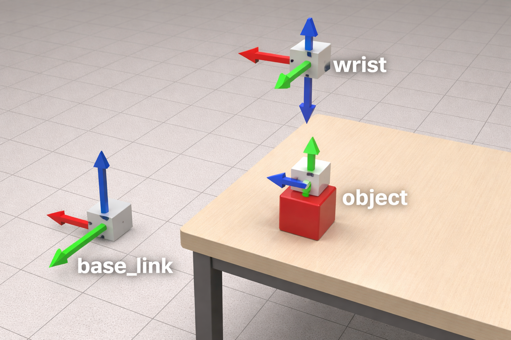

# Notes to move arm 

1) $ _{wrist} ^{base}T[:,3] = ^{base} d$

2) $^{obj} d = ^{obj} _{head}T  ^{head} _{base}T  ^{base}d$

3) $^{wrist} _{obj}T ( ^{obj} d + ^{obj} x ) = ^{wrist} x_{obj-axis}$

4) where, $^{wrist} _{obj}T = ^{wrist} _{base}T ^{base} _{head}T ^{head} _{obj}T$

5) $ arccos( \frac{\begin{bmatrix}0 \\ 0 \\ 1 \end{bmatrix}· ^{wrist} X_{obj-axis}}{|\begin{bmatrix}0 \\ 0 \\ 1 \end{bmatrix}| * |^{wrist} X_{obj-axis}|})$

# Part 2

1) (Origin of wrist frame w.r.t base frame(last column = translation))
$^{base} p_{wrist-org} = ^{base} _{wrist}T[:,3]$ 

2) $^{head} _{obj}T = \begin{bmatrix} 0 & 0 & 1 & 0 \\ -1 & 0 & 0 & 0 \\ 0 & -1 & 0 & 0 \\ 0 & 0 & 0 & 1\end{bmatrix}[reference file]$
(Add to TF tree: obj frame as child of head)

$^{obj} _{head}T  ^{head} _{base}T ^{obj} _{base}T= ^{obj} p_{wrist-org}$

Origin of wrist frame w.r.t object frame

3) $^{obj} p_{wrist-org} + \begin{bmatrix} 1 \\ 0 \\ 0 \\ 0 \end{bmatrix}$ (to align x-axis)

4) $^{wrist} _{base}T ^{base} _{obj}T ^{head} _{obj}T d_x = ^{wrist} d_x$  
but in code: 
$^{wrist} _{base}T ^{base} _{head}T ^{head} _{obj}T ^{obj}d_x = ^{wrist} d_x$

5) Display $^{wrist} d_x$
